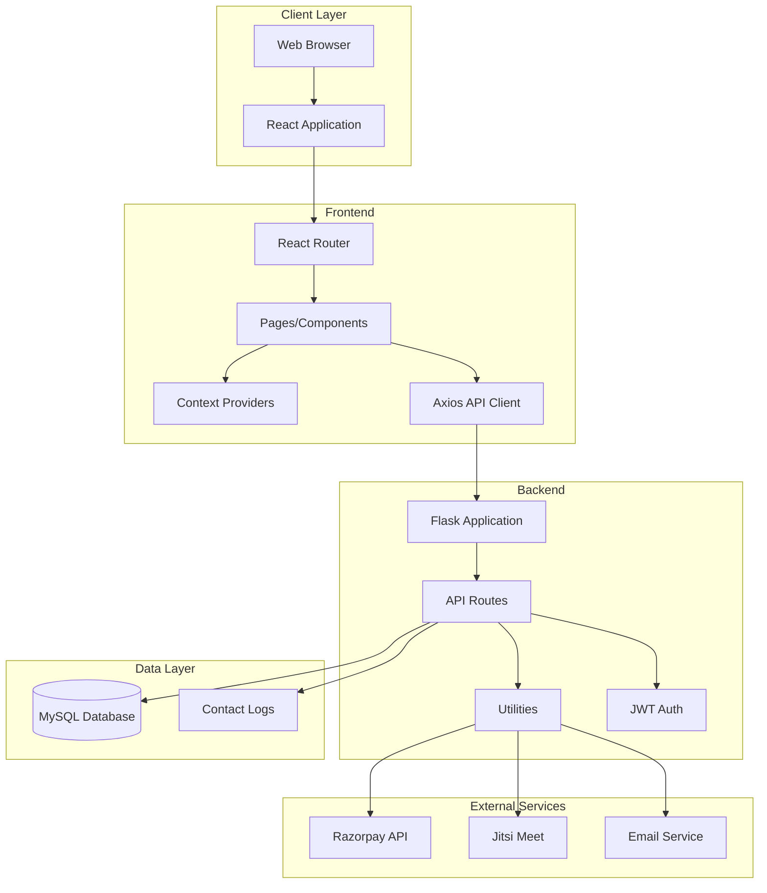
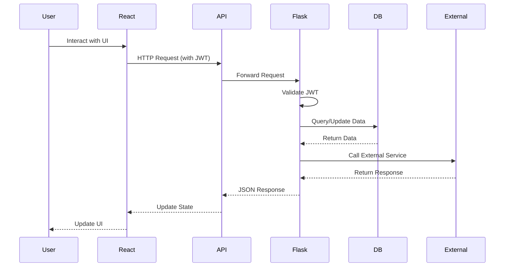

# CarrerPortal Design Document

## Overview

CarrerPortal is a full-stack web application built with a React frontend and Flask backend. The system provides skill-based career recommendations, expert consultations, and career development resources. The architecture follows a client-server model with RESTful API communication, JWT-based authentication, and integration with third-party services (Razorpay for payments, Jitsi Meet for video, email services for notifications).

### Technology Stack

**Frontend:**
- React 18+ (JSX, no TypeScript)
- Vite (build tool)
- React Router v6 (routing)
- Tailwind CSS + Bootstrap 5 (styling)
- Formik + Yup (form validation)
- Axios (HTTP client)
- Context API (state management)
- Recharts (admin charts)
- Framer Motion (animations)
- jsPDF/react-to-print (PDF generation)

**Backend:**
- Python 3.10+
- Flask (web framework)
- Flask-CORS (cross-origin support)
- Flask-Mail (email)
- MySQL (database)
- SQLAlchemy (ORM)
- JWT (authentication)
- bcrypt (password hashing)

**Third-Party Services:**
- Razorpay (payment processing)
- Jitsi Meet (video conferencing)
- Gmail SMTP / SendGrid (email delivery)
- Google Fonts (Inter typeface)

## Architecture

### System Architecture Diagram



### Frontend Architecture

The frontend follows a component-based architecture with clear separation of concerns:

1. **Routing Layer**: React Router v6 handles navigation with lazy-loaded route components
2. **Page Layer**: Top-level page components for each route
3. **Component Layer**: Reusable UI components (Nav, Footer, Cards, Forms, etc.)
4. **Context Layer**: Global state management for authentication and theme
5. **API Layer**: Centralized Axios instance with interceptors for authentication
6. **Data Layer**: Static data files for portfolio, services, and blog content

### Backend Architecture

The backend follows a modular Flask application structure:

1. **Application Layer**: Flask app initialization and configuration
2. **Routes Layer**: Blueprint-based route handlers organized by feature
3. **Utils Layer**: Helper functions for JWT, email, payments, and Jitsi
4. **Data Layer**: SQLAlchemy models and database interactions
5. **Middleware**: CORS, authentication, and error handling

### Communication Flow



## Components and Interfaces

### Frontend Components

#### Global Components

**Nav.jsx**
- Sticky navigation bar with logo and links
- Responsive hamburger menu for mobile
- Active link highlighting
- "Get a Quote" CTA button
- Scroll-based compression animation
- Keyboard accessible with ARIA attributes

**Footer.jsx**
- Quick links to main pages
- Social media icons
- Newsletter subscription input
- Terms and Privacy links
- Consistent across all pages

**ThemeToggle.jsx**
- Toggle button for light/dark mode
- Detects system preference via `prefers-color-scheme`
- Persists choice to localStorage
- Updates CSS variables for theme colors

**Toast.jsx**
- Success and error notifications
- Auto-dismiss after 5 seconds
- Manual dismiss button
- Accessible with ARIA live regions

**Modal.jsx**
- Reusable modal container
- Framer Motion animations
- Focus trap for accessibility
- Close on ESC key or backdrop click

#### Page Components

**Home.jsx**
- Hero section with title, subtitle, and CTAs
- Services summary (3-5 cards)
- Featured portfolio carousel (3 items)
- Testimonials section
- Pricing CTA card
- Mini contact form

**Services.jsx**
- List of 5 services with details
- Service cards with icon, description, timeline, price
- "Request Quote" button (navigates to Contact with prefilled service)

**Portfolio.jsx**
- Grid of 8 portfolio items
- Tag-based filtering
- Debounced search input
- Keyboard-accessible filter controls
- Links to individual project pages

**ProjectPage.jsx**
- Full project details
- Image gallery
- Tech stack list
- Challenge and solution sections
- Client type
- "Contact about this project" CTA

**About.jsx**
- Company story and mission
- Workflow timeline (5 phases)
- Team member cards (2 founders)
- Achievement badges

**Blog.jsx**
- List of blog posts
- Post cards with title, excerpt, date
- Links to individual post pages

**PostPage.jsx**
- Full blog post content
- Optimized images
- Social share buttons

**Contact.jsx**
- Full contact form (ContactForm component)
- Alternate contact info
- Calendly embed placeholder
- Office address

**NotFound.jsx**
- 404 error page
- Link back to home

#### Feature Components

**ContactForm.jsx**
- Formik form with Yup validation
- Fields: fullName, businessName, email, phone, budgetRange, interestedService, message, consent
- Hidden honeypot field
- Optional reCAPTCHA integration
- Inline validation errors
- Submit to `/api/contact` endpoint
- Toast notifications for success/error

**MiniContactForm.jsx**
- Simplified version for home page
- Essential fields only
- Same backend endpoint

**PortfolioGrid.jsx**
- Grid layout with responsive columns
- Filter controls
- Search input with debounce
- Renders ProjectCard components

**ProjectCard.jsx**
- Portfolio item preview
- Image, title, tags
- Hover animation
- Click to navigate to detail page

**ServiceCard.jsx**
- Service information display
- Icon, title, description
- Timeline and price range
- CTA button

**Hero.jsx**
- Large heading and subtitle
- Primary and secondary CTAs
- Framer Motion entrance animations

**JitsiEmbed.jsx**
- Iframe embed for Jitsi Meet
- Room ID from booking
- Responsive container

**LazyImage.jsx**
- Image with lazy loading
- Placeholder skeleton while loading
- Error fallback

### Backend Routes

#### Authentication Routes (`/auth`)

```python
POST /auth/register
- Body: { name, email, password }
- Returns: { success, message, user_id }

POST /auth/login
- Body: { email, password }
- Returns: { success, access_token, refresh_token, user }

POST /auth/refresh
- Headers: Authorization: Bearer <refresh_token>
- Returns: { access_token }

POST /auth/logout
- Headers: Authorization: Bearer <access_token>
- Returns: { success, message }
```

#### Skills Routes (`/skills`)

```python
GET /skills
- Returns: { skills: [{ id, name, category }] }

POST /skills/user
- Headers: Authorization: Bearer <access_token>
- Body: { skills: [{ skill_id, proficiency }] }
- Returns: { success, message }
```

#### Careers Routes (`/careers`)

```python
POST /careers/recommend
- Headers: Authorization: Bearer <access_token>
- Returns: { careers: [{ id, title, description, match_score }] }

GET /careers/:id
- Returns: { career: { id, title, description, required_skills, salary_range, demand_level, roadmap } }

GET /careers/:id/skill-gap
- Headers: Authorization: Bearer <access_token>
- Returns: { gaps: [{ skill, current_level, required_level }] }

POST /careers/save
- Headers: Authorization: Bearer <access_token>
- Body: { career_id }
- Returns: { success, message }
```

#### Experts Routes (`/experts`)

```python
POST /experts/register
- Headers: Authorization: Bearer <access_token>
- Body: { bio, resume_url, certificate_urls, rate_per_hour }
- Returns: { success, expert_id }

GET /experts
- Query: ?status=approved
- Returns: { experts: [{ id, name, bio, rate_per_hour }] }
```

#### Bookings Routes (`/bookings`)

```python
POST /bookings/create
- Headers: Authorization: Bearer <access_token>
- Body: { expert_id, slot_start, slot_end }
- Returns: { success, booking_id, jitsi_room }

GET /bookings/user
- Headers: Authorization: Bearer <access_token>
- Returns: { bookings: [{ id, expert, slot_start, slot_end, jitsi_room, status }] }
```

#### Payments Routes (`/payments`)

```python
POST /payments/create-order
- Headers: Authorization: Bearer <access_token>
- Body: { booking_id, amount }
- Returns: { order_id, amount, currency }

POST /payments/verify
- Headers: Authorization: Bearer <access_token>
- Body: { razorpay_order_id, razorpay_payment_id, razorpay_signature }
- Returns: { success, message }
```

#### Contact Route (`/contact`)

```python
POST /contact
- Body: { fullName, businessName, email, phone, budgetRange, interestedService, message, consent, website (honeypot) }
- Returns: { success, message }
- Side effects: Send email, log to file in dev mode
```

## Data Models

### Database Schema

```sql
-- Users table
CREATE TABLE users (
    id INT AUTO_INCREMENT PRIMARY KEY,
    name VARCHAR(255) NOT NULL,
    email VARCHAR(255) UNIQUE NOT NULL,
    password_hash VARCHAR(255) NOT NULL,
    is_admin BOOLEAN DEFAULT FALSE,
    created_at TIMESTAMP DEFAULT CURRENT_TIMESTAMP,
    INDEX idx_email (email)
);

-- Skills table
CREATE TABLE skills (
    id INT AUTO_INCREMENT PRIMARY KEY,
    name VARCHAR(255) NOT NULL,
    category VARCHAR(100) NOT NULL,
    INDEX idx_category (category)
);

-- User skills junction table
CREATE TABLE user_skills (
    user_id INT NOT NULL,
    skill_id INT NOT NULL,
    proficiency ENUM('beginner', 'intermediate', 'advanced', 'expert') NOT NULL,
    PRIMARY KEY (user_id, skill_id),
    FOREIGN KEY (user_id) REFERENCES users(id) ON DELETE CASCADE,
    FOREIGN KEY (skill_id) REFERENCES skills(id) ON DELETE CASCADE
);

-- Careers table
CREATE TABLE careers (
    id INT AUTO_INCREMENT PRIMARY KEY,
    title VARCHAR(255) NOT NULL,
    description TEXT NOT NULL,
    salary_range VARCHAR(100),
    demand_level ENUM('low', 'medium', 'high', 'very_high') NOT NULL,
    roadmap TEXT,
    created_at TIMESTAMP DEFAULT CURRENT_TIMESTAMP
);

-- Career skills junction table
CREATE TABLE career_skills (
    career_id INT NOT NULL,
    skill_id INT NOT NULL,
    required_level ENUM('beginner', 'intermediate', 'advanced', 'expert') NOT NULL,
    PRIMARY KEY (career_id, skill_id),
    FOREIGN KEY (career_id) REFERENCES careers(id) ON DELETE CASCADE,
    FOREIGN KEY (skill_id) REFERENCES skills(id) ON DELETE CASCADE
);

-- Experts table
CREATE TABLE experts (
    id INT AUTO_INCREMENT PRIMARY KEY,
    user_id INT NOT NULL UNIQUE,
    bio TEXT NOT NULL,
    resume_url VARCHAR(500),
    certificate_urls JSON,
    rate_per_hour DECIMAL(10, 2) NOT NULL,
    status ENUM('pending', 'approved', 'rejected') DEFAULT 'pending',
    created_at TIMESTAMP DEFAULT CURRENT_TIMESTAMP,
    FOREIGN KEY (user_id) REFERENCES users(id) ON DELETE CASCADE
);

-- Bookings table
CREATE TABLE bookings (
    id INT AUTO_INCREMENT PRIMARY KEY,
    user_id INT NOT NULL,
    expert_id INT NOT NULL,
    slot_start DATETIME NOT NULL,
    slot_end DATETIME NOT NULL,
    jitsi_room VARCHAR(255) NOT NULL,
    status ENUM('pending', 'confirmed', 'completed', 'cancelled') DEFAULT 'pending',
    created_at TIMESTAMP DEFAULT CURRENT_TIMESTAMP,
    FOREIGN KEY (user_id) REFERENCES users(id) ON DELETE CASCADE,
    FOREIGN KEY (expert_id) REFERENCES experts(id) ON DELETE CASCADE,
    INDEX idx_user_bookings (user_id),
    INDEX idx_expert_bookings (expert_id)
);

-- Transactions table
CREATE TABLE transactions (
    id INT AUTO_INCREMENT PRIMARY KEY,
    booking_id INT NOT NULL,
    razorpay_order_id VARCHAR(255) NOT NULL,
    razorpay_payment_id VARCHAR(255),
    razorpay_signature VARCHAR(255),
    amount DECIMAL(10, 2) NOT NULL,
    currency VARCHAR(10) DEFAULT 'INR',
    status ENUM('created', 'completed', 'failed') DEFAULT 'created',
    created_at TIMESTAMP DEFAULT CURRENT_TIMESTAMP,
    FOREIGN KEY (booking_id) REFERENCES bookings(id) ON DELETE CASCADE,
    INDEX idx_order (razorpay_order_id)
);

-- Saved careers table
CREATE TABLE saved_careers (
    user_id INT NOT NULL,
    career_id INT NOT NULL,
    saved_at TIMESTAMP DEFAULT CURRENT_TIMESTAMP,
    PRIMARY KEY (user_id, career_id),
    FOREIGN KEY (user_id) REFERENCES users(id) ON DELETE CASCADE,
    FOREIGN KEY (career_id) REFERENCES careers(id) ON DELETE CASCADE
);

-- Learning resources table
CREATE TABLE learning_resources (
    id INT AUTO_INCREMENT PRIMARY KEY,
    career_id INT NOT NULL,
    title VARCHAR(255) NOT NULL,
    url VARCHAR(500) NOT NULL,
    resource_type ENUM('course', 'article', 'video', 'book') NOT NULL,
    created_at TIMESTAMP DEFAULT CURRENT_TIMESTAMP,
    FOREIGN KEY (career_id) REFERENCES careers(id) ON DELETE CASCADE
);

-- Feedbacks table
CREATE TABLE feedbacks (
    id INT AUTO_INCREMENT PRIMARY KEY,
    user_id INT NOT NULL,
    booking_id INT,
    rating INT CHECK (rating >= 1 AND rating <= 5),
    comment TEXT,
    created_at TIMESTAMP DEFAULT CURRENT_TIMESTAMP,
    FOREIGN KEY (user_id) REFERENCES users(id) ON DELETE CASCADE,
    FOREIGN KEY (booking_id) REFERENCES bookings(id) ON DELETE SET NULL
);
```

### Frontend Data Structures

**Portfolio Item**
```javascript
{
  id: number,
  slug: string,
  title: string,
  tags: string[],
  images: string[],
  description: string,
  techStack: string[],
  challenge: string,
  solution: string,
  clientType: string,
  url: string (optional)
}
```

**Service**
```javascript
{
  id: number,
  name: string,
  icon: string,
  description: string,
  bullets: string[],
  timeline: string,
  priceRange: string
}
```

**Blog Post**
```javascript
{
  id: number,
  slug: string,
  title: string,
  excerpt: string,
  content: string,
  author: string,
  publishedAt: string,
  image: string,
  tags: string[]
}
```

## Error Handling

### Frontend Error Handling

1. **Global Error Boundary**: Catches React component errors and displays fallback UI
2. **API Error Interceptor**: Axios interceptor catches HTTP errors and handles:
   - 401 Unauthorized: Redirect to login, attempt token refresh
   - 403 Forbidden: Show access denied message
   - 404 Not Found: Show not found message
   - 500 Server Error: Show generic error message
3. **Form Validation Errors**: Formik displays inline validation errors
4. **Toast Notifications**: User-friendly error messages for failed actions

### Backend Error Handling

1. **Global Exception Handler**: Catches unhandled exceptions and returns JSON error response
2. **Validation Errors**: Return 400 Bad Request with validation error details
3. **Authentication Errors**: Return 401 Unauthorized for invalid/expired tokens
4. **Authorization Errors**: Return 403 Forbidden for insufficient permissions
5. **Database Errors**: Log error details, return generic 500 error to client
6. **External Service Errors**: Catch and handle Razorpay, email, and Jitsi errors gracefully

### Error Response Format

```javascript
{
  success: false,
  error: "Human-readable error message",
  code: "ERROR_CODE", // optional
  details: {} // optional, for validation errors
}
```

## Testing Strategy

### Frontend Testing

**Unit Tests**
- Test individual components in isolation
- Focus on ContactForm validation logic
- Test utility functions and hooks
- Use Jest + React Testing Library

**Example Test Structure**
```javascript
describe('ContactForm', () => {
  it('should display validation errors for empty required fields', () => {
    // Test implementation
  });
  
  it('should submit form data when valid', async () => {
    // Test implementation
  });
  
  it('should reject submission if honeypot is filled', () => {
    // Test implementation
  });
});
```

**Integration Tests** (optional)
- Test page-level interactions
- Test routing and navigation
- Test API integration with mocked responses

**Accessibility Tests**
- Use jest-axe for automated accessibility testing
- Manual keyboard navigation testing
- Screen reader testing

### Backend Testing

**Unit Tests**
- Test route handlers with mocked database
- Test utility functions (JWT, email, payments)
- Test validation logic

**Integration Tests**
- Test API endpoints with test database
- Test authentication flow
- Test payment verification
- Test email sending

**Security Tests**
- Test SQL injection prevention
- Test XSS prevention
- Test authentication bypass attempts
- Test rate limiting

## Security Considerations

### Authentication and Authorization

1. **Password Security**
   - Hash passwords with bcrypt (cost factor 12)
   - Never store plain-text passwords
   - Implement password strength requirements

2. **JWT Security**
   - Use strong secret keys (256-bit minimum)
   - Set appropriate expiration times (15 min access, 7 days refresh)
   - Store refresh tokens securely
   - Implement token rotation

3. **Session Management**
   - Invalidate tokens on logout
   - Implement token blacklist for revoked tokens

### Input Validation and Sanitization

1. **Frontend Validation**
   - Validate all form inputs with Yup schemas
   - Sanitize user input before display
   - Use Content Security Policy headers

2. **Backend Validation**
   - Re-validate all inputs server-side
   - Use parameterized queries (SQLAlchemy ORM)
   - Sanitize HTML content with bleach library
   - Validate file uploads (type, size)

### Spam Prevention

1. **Honeypot Field**
   - Hidden field in contact form
   - Reject submissions if filled

2. **reCAPTCHA** (optional)
   - Verify reCAPTCHA token server-side
   - Configurable via environment variable

3. **Rate Limiting**
   - Implement Flask-Limiter
   - Limit contact form submissions (5 per hour per IP)
   - Limit login attempts (5 per 15 minutes per IP)

### Payment Security

1. **Razorpay Integration**
   - Never expose secret key to frontend
   - Verify payment signatures server-side
   - Use HTTPS for all payment requests
   - Log all payment transactions

### Data Protection

1. **HTTPS Only**
   - Enforce HTTPS in production
   - Set Secure flag on cookies

2. **CORS Configuration**
   - Whitelist specific origins
   - Don't use wildcard (*) in production

3. **Environment Variables**
   - Store secrets in .env files
   - Never commit .env to version control
   - Use different secrets for dev/prod

## Performance Optimization

### Frontend Optimization

1. **Code Splitting**
   - Lazy load route components with React.lazy
   - Use Suspense for loading states
   - Split large components

2. **Image Optimization**
   - Use lazy loading (loading="lazy")
   - Implement LazyImage component with placeholders
   - Use appropriate image formats and sizes
   - Use CDN for static assets

3. **Bundle Optimization**
   - Tree shaking with Vite
   - Minification in production
   - Gzip compression

4. **Caching**
   - Cache static assets with long expiration
   - Use service worker for offline support (optional)

### Backend Optimization

1. **Database Optimization**
   - Add indexes on frequently queried columns
   - Use connection pooling
   - Implement query result caching

2. **API Optimization**
   - Implement pagination for list endpoints
   - Use field selection to reduce payload size
   - Compress responses with gzip

3. **Caching Strategy**
   - Cache static data (skills, careers)
   - Use Redis for session storage (optional)

## Deployment Architecture

### Frontend Deployment (Vercel/Netlify)

1. **Build Configuration**
   - Build command: `npm run build`
   - Output directory: `dist`
   - Environment variables via platform UI

2. **Environment Variables**
   - VITE_API_URL: Backend API URL
   - VITE_RAZORPAY_KEY_ID: Razorpay publishable key

3. **Optimizations**
   - Enable automatic HTTPS
   - Configure CDN caching
   - Set up custom domain

### Backend Deployment (Render/Heroku/VPS)

1. **Platform Configuration**
   - Python version: 3.10+
   - Start command: `gunicorn app:app`
   - Environment variables via platform UI

2. **Environment Variables**
   - All backend env vars from .env.example
   - Use platform secrets management

3. **Database**
   - Use managed MySQL service (AWS RDS, PlanetScale)
   - Or self-hosted MySQL on VPS
   - Run schema.sql and seed.sql on initial setup

4. **Monitoring**
   - Set up error logging (Sentry)
   - Monitor API performance
   - Set up health check endpoint

### Alternative: Single VPS Deployment

1. **Server Setup**
   - Ubuntu 20.04+ server
   - Nginx as reverse proxy
   - SSL certificate with Let's Encrypt

2. **Backend**
   - Run Flask with Gunicorn
   - Systemd service for auto-restart
   - Nginx proxy to Flask

3. **Frontend**
   - Build React app
   - Serve static files with Nginx
   - Configure SPA routing

4. **Database**
   - MySQL installed on same server
   - Regular backups configured

## Development Workflow

### Local Development Setup

1. **Frontend**
   ```bash
   cd frontend
   npm install
   cp .env.example .env
   # Edit .env with local API URL
   npm run dev
   ```

2. **Backend**
   ```bash
   cd backend
   python -m venv venv
   source venv/bin/activate  # or venv\Scripts\activate on Windows
   pip install -r requirements.txt
   cp .env.example .env
   # Edit .env with database credentials
   flask run
   ```

3. **Database**
   ```bash
   mysql -u root -p
   CREATE DATABASE carrerportal;
   mysql -u root -p carrerportal < schema.sql
   mysql -u root -p carrerportal < seed.sql
   ```

### Code Quality Tools

1. **ESLint**: Lint JavaScript code
2. **Prettier**: Format code consistently
3. **Husky**: Pre-commit hooks (optional)
4. **Jest**: Run tests before commit

### Git Workflow

1. Feature branches from main
2. Pull request for code review
3. CI/CD pipeline runs tests
4. Merge to main triggers deployment

## Third-Party Service Integration

### Razorpay Integration

1. **Order Creation**
   - Backend creates order with amount and currency
   - Returns order_id to frontend
   - Frontend opens Razorpay checkout modal

2. **Payment Verification**
   - Frontend receives payment_id and signature
   - Sends to backend for verification
   - Backend verifies signature using secret key
   - Updates transaction status

### Jitsi Meet Integration

1. **Room Generation**
   - Backend generates UUID for room
   - Stores in booking record
   - Returns to frontend

2. **Video Embed**
   - Frontend embeds Jitsi iframe
   - URL: `https://meet.jit.si/{room_id}`
   - Configure display name and other options

### Email Service Integration

1. **Gmail SMTP** (Primary)
   - Configure Flask-Mail with Gmail credentials
   - Use app-specific password
   - Send HTML emails with templates

2. **SendGrid** (Alternative)
   - Configure SendGrid API key
   - Use SendGrid Python library
   - Fallback to Flask-Mail if not configured

## Accessibility Implementation

### WCAG 2.1 AA Compliance

1. **Semantic HTML**
   - Use proper heading hierarchy (h1-h6)
   - Use semantic elements (nav, main, footer, article)
   - Use button elements for actions

2. **ARIA Attributes**
   - aria-label for icon buttons
   - aria-expanded for collapsible elements
   - aria-live for dynamic content (toasts)
   - aria-describedby for form errors

3. **Keyboard Navigation**
   - All interactive elements focusable
   - Visible focus indicators
   - Logical tab order
   - Skip to content link

4. **Color and Contrast**
   - Minimum 4.5:1 contrast for text
   - Don't rely on color alone
   - Test with color blindness simulators

5. **Motion and Animation**
   - Respect prefers-reduced-motion
   - Provide pause controls for auto-playing content
   - Avoid flashing content

## Design System

### Color Palette

**Light Mode**
- Primary Gradient: #6EE7B7 → #3B82F6
- Accent: #8B5CF6
- Background: #FFFFFF
- Surface: #F9FAFB
- Text Primary: #111827
- Text Secondary: #6B7280
- Border: #E5E7EB

**Dark Mode**
- Primary Gradient: #6EE7B7 → #3B82F6 (same)
- Accent: #8B5CF6 (same)
- Background: #111827
- Surface: #1F2937
- Text Primary: #F9FAFB
- Text Secondary: #D1D5DB
- Border: #374151

### Typography

- Font Family: Inter (Google Fonts)
- Headings: 700 weight
- Body: 400 weight
- Small: 300 weight

### Spacing Scale

- xs: 0.25rem (4px)
- sm: 0.5rem (8px)
- md: 1rem (16px)
- lg: 1.5rem (24px)
- xl: 2rem (32px)
- 2xl: 3rem (48px)
- 3xl: 4rem (64px)

### Component Patterns

**Cards**
- Rounded corners (8px)
- Subtle shadow
- Hover: lift effect with increased shadow
- Padding: lg (24px)

**Buttons**
- Primary: gradient background
- Secondary: outline with accent color
- Rounded: 6px
- Padding: sm md (8px 16px)
- Hover: slight scale increase

**Forms**
- Input height: 40px
- Border radius: 6px
- Focus: accent color ring
- Error: red border and text

## Conclusion

This design document provides a comprehensive blueprint for implementing CarrerPortal. The architecture balances modern best practices with practical implementation considerations. The modular structure allows for incremental development and easy maintenance. Security, accessibility, and performance are prioritized throughout the design.
